## Гайд для заказчика: как оценить Angelo

Стенд для проверки: `https://angelo-test.ru`

В приложении есть **2 режима**:
- **Демо‑режим** — быстро посмотреть интерфейс и сценарии на “примерных” данных.
- **Реальный режим** — проверить реальную работу сервера: регистрация, сохранение профиля, загрузка медиа, публикации.

Если вы видите “чужие” фото/имена или демонстрационные заглушки — проверьте, что вы **не в демо‑режиме**.

---

## 1) Демо‑режим (быстро посмотреть UX)

### Как включить
- На главной странице нажать **маленькую кнопку “Демо”**.

### Скрин‑шаги (куда нажимать)

1) Главная страница: кнопка **“Демо”**

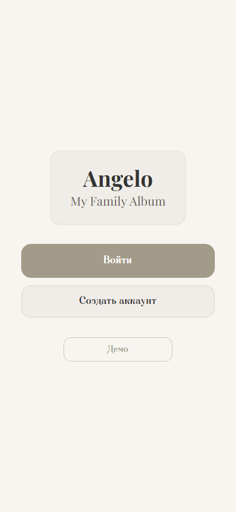

2) Демо‑лента (пример данных)

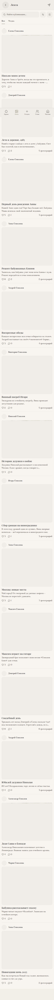

### Что смотреть (рекомендуемая проверка 5–10 минут)
- **Навигация**: нижнее меню, переходы по разделам.
- **Лента**: список публикаций, открытие публикации, скролл, фильтры/поиск (если доступны).
- **Семья**: “Обо мне”, “Семья”, поиск.
- **Дерево**: клики по участникам, переходы в профили.

### Что важно понимать
- В демо данные/фото могут быть **моковые** (примерные), не из вашей семьи.
- Некоторые действия в демо могут **не сохраняться на сервере** (только “витрина”).

---

## 2) Реальный режим (проверка “по‑настоящему”)

### Как включить
- На главной нажать **“Войти”** или **“Создать аккаунт”** (это выключает демо‑режим).

### Скрин‑шаги (рекомендуемый сценарий проверки)

1) Регистрация

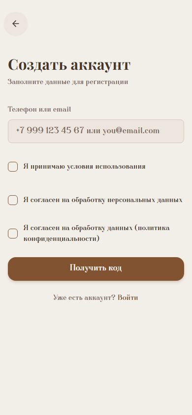

2) Подтверждение кода

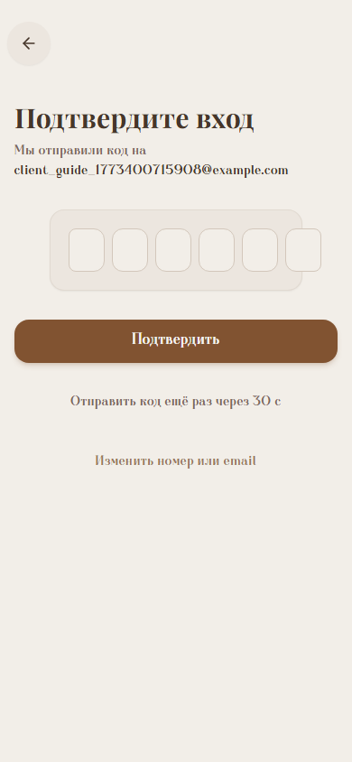

3) Онбординг: заполнение профиля и загрузка аватара

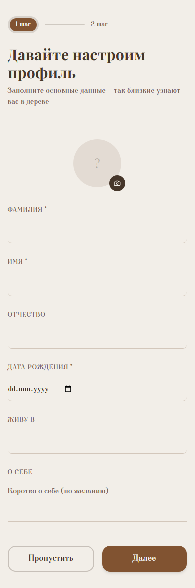

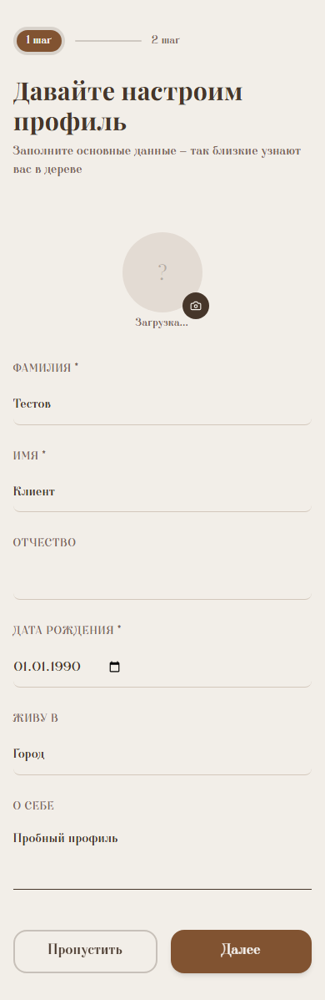

4) Дерево после онбординга

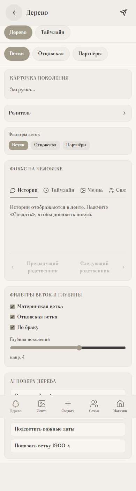

5) “Семья” → “Обо мне”

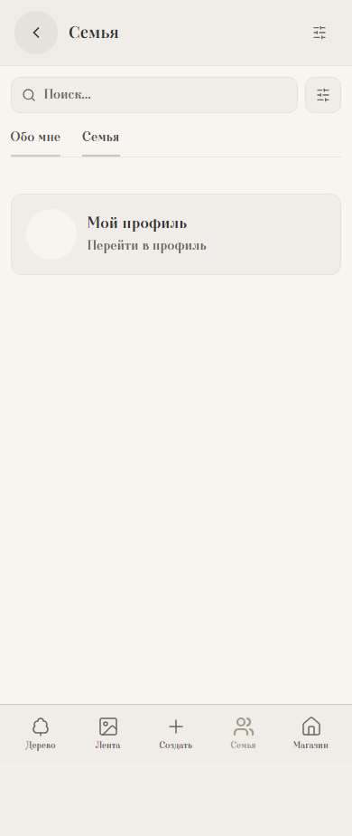

6) “Создать” → выбор типа

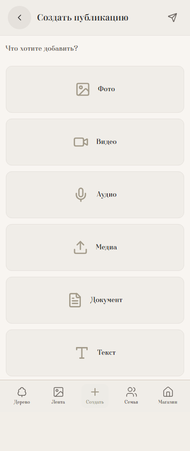

7) Публикация “Текст” (выбор темы + заполнение)

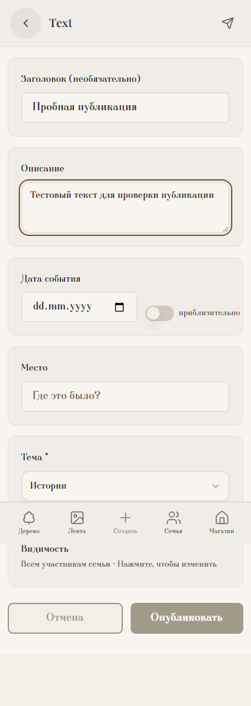

8) Лента после публикации

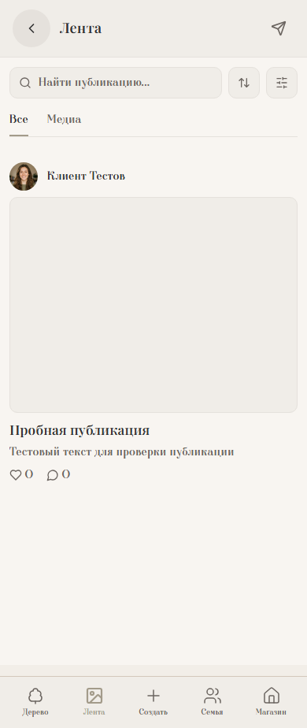

9) Магазин

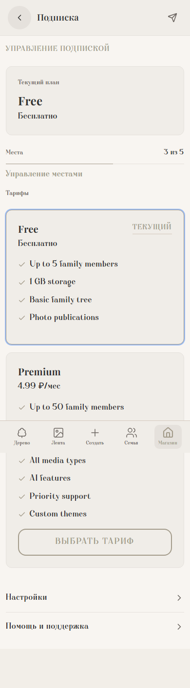

### Что обязательно проверить, чтобы оценить продукт

#### A) Регистрация/вход
- Создайте аккаунт по телефону или email.
- Подтвердите код.

Примечание для тестового стенда: **код может не проверяться** — можно ввести любой 6‑значный код.

#### B) Онбординг (профиль)
- Заполните минимум:
  - Фамилия
  - Имя
  - Дата рождения
- Загрузите **аватар** (это проверка реальной загрузки в хранилище).
- Нажмите **“Далее”**.

Ожидаемо:
- Аватар после загрузки отображается сразу на экране и сохраняется.

#### C) “Мой профиль” / “Редактировать профиль”
- Откройте **“Мой профиль”**.
- Проверьте, что показывается **ваш аватар**, а не заглушка.
- Нажмите **“Редактировать профиль”**:
  - поменяйте “О себе” / “Город”
  - попробуйте **сменить аватар**
  - сохраните

Ожидаемо:
- После сохранения данные и аватар остаются такими же при обновлении страницы.

#### D) Публикации
Сделайте 2 публикации:
- **Текстовую** (без файлов)
- **С фото** (или видео/аудио — по желанию)

Ожидаемо:
- Публикации появляются в ленте.
- В карточке публикации:
  - автор — вы
  - медиа — ваше, загруженное
- Публикация открывается в деталях.

---

## 3) Типичные “симптомы” и что это значит

- **В ленте видны моковые фото/другие авторы**:
  - вероятно включён демо‑режим, или часть экранов работает в демо‑логике.
- **Аватар загрузился, но не отображается / 403 на картинке**:
  - обычно проблема доступа к хранилищу (MinIO) или настройка публичного URL.
- **500 Internal Server Error**:
  - проблема на стороне сервера/nginx (нужны логи и URL).

---

## 4) Как правильно сообщать об ошибках (чтобы быстро исправили)

Пожалуйста, присылайте:
- **Что делали**: шаги 1→2→3 (как можно точнее).
- **Где**: ссылка на страницу (URL).
- **Что ожидали** и **что получили**.
- **Скриншот/видео**.
- **DevTools**:
  - Console: ошибки (красные строки)
  - Network: запросы со статусом 4xx/5xx (особенно `presign`, `PUT`, `/api/*`)
- **Время** (примерно) и ваш браузер.

Шаблон:
- Шаги:
- URL:
- Ожидалось:
- Получилось:
- Console errors:
- Network (status/URL):

---

## 5) Для тех. команды (прозрачность проверки стенда)

На `https://angelo-test.ru` выполнен автоматический smoke‑прогон (Playwright):
- Регистрация → confirm code → онбординг (загрузка аватара) → навигация → создание текст‑публикации
- Критические проверки: **нет HTTP 5xx**, **нет pageerror**, **нет console error**

Файл сценария: `e2e/smoke.spec.ts`

