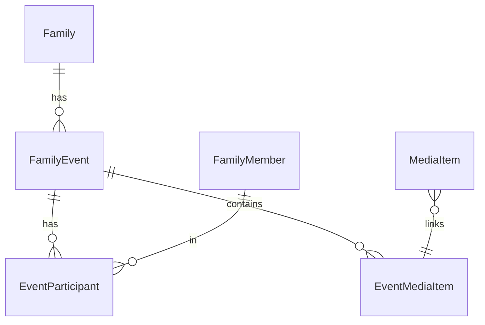

# Черновик доменной модели «Событие» (History)

Согласовать с заказчиком до миграции БД. Сейчас в продукте ближайший аналог — **Publication** с `event_date`, `participant_ids`, медиа и текстом; в видении событие — **отдельная сущность** с обязательными полями и связью M2M с профилями.

## Сущности (логическая модель)

- **FamilyEvent** (или `timeline_event`): одна запись на таймлайне «Истории».
- **FamilyMember**: существующий профиль родственника; часть профилей без учётной записи User.
- **EventParticipant**: связь M2M **FamilyEvent ↔ FamilyMember** (участник события; от неё наследуются правила видимости в упрощённой модели).
- **EventMedia** / вложения: ссылки на **MediaItem** или на объекты в хранилище (как у публикаций).
- Опционально **EventSourceRef**: «создано из сообщения / из альбома / из публикации» для трассировки.

## Атрибуты FamilyEvent (из видения)

| Поле | Обязательность | Примечание |
|------|----------------|------------|
| title | да | Название |
| event_date | да | Дата для таймлайна; отдельно флаг «приблизительно», как у публикаций |
| participants | ≥ 1 member_id | M2M |
| family_id | да | К какой семье относится событие (текущая модель «семьи») |
| created_by | да | User или FamilyMember, кто создал |
| visibility / ACL | позже | Наследовать от участников или явная политика |

Контент: текстовые блоки, галерея, ссылки на существующие медиа — можно унифицировать с `content_blocks` у Publication или вынести в отдельную таблицу.

## ER (концептуально)

## Черновик HTTP API (под `/api`)

- `GET /history/events` — список с фильтрами: `from`, `to`, `member_ids`, `granularity` (day/year/decade агрегация на бэке или на фронте — обсудить).
- `GET /history/events/{id}` — карточка + медиа + права.
- `POST /history/events` — создание (тело: title, event_date, approximate, participant_ids, content…).
- `PATCH /history/events/{id}` — правка.
- `POST /history/events/{id}/share-to-chat` — заглушка или интеграция с мессенджером (после модели комнат).
- `POST /history/events/from-publication` — опциональная миграция/дублирование из существующей Publication.

## Согласование с разработкой

1. **Заменить Publication или жить рядом:** вариант «Event как надстройка над одной Publication» vs «постепенная миграция полей с публикации на событие».
2. **Лента публикаций vs История:** остаётся ли отдельная «лента» как неструктурированный поток или всё становится событиями + чат.
3. Права при «разводе / две семьи» — отдельное продуктовое ТЗ.

После утверждения — Alembic-миграции и адаптация `backend/app/api/feed.py` / новый роутер `history.py`.
